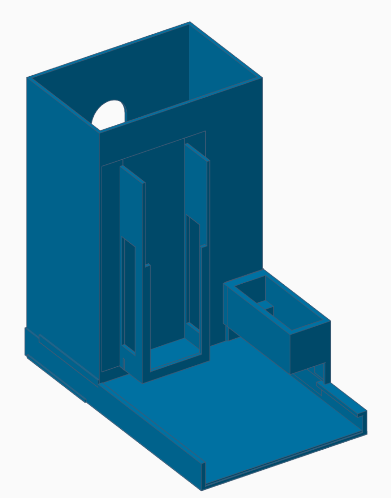
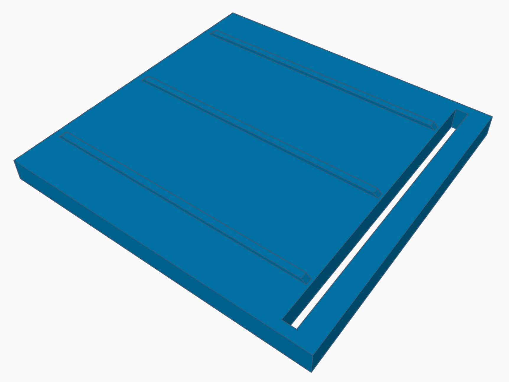
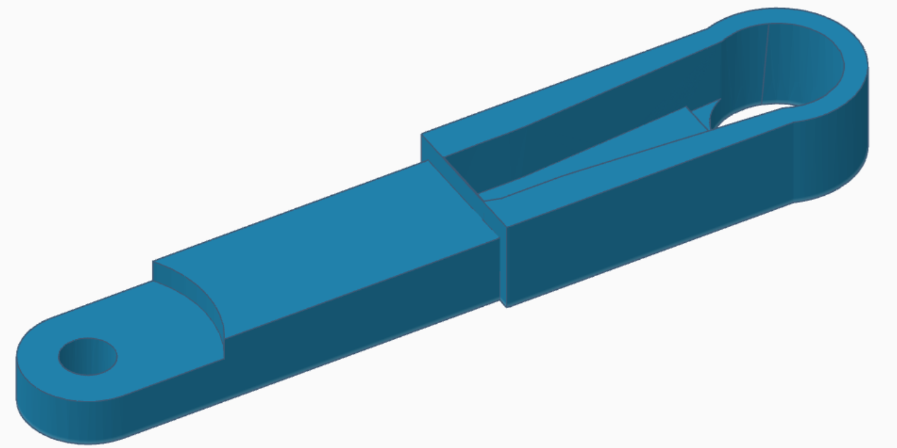
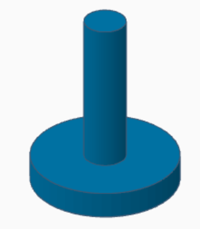

# 3D printable parts - Spenser - a developer's companion v1.0.0

* [**Table of Contents**](toc.md)
* **3D printable parts**

## 3D printable parts

Below are the 3D parts used to build **Spenser**.

### Description

| | | | |
| :--- | :--- | :--- | :--- |
| **Body** |  | Holds the chocolate stack, the servo motor and the slider rails, on its own base. | [STL](spenser-body.stl) |
| **Pusher** |  | Slides along the rails and pushes one chocolate out. | [STL](spenser-pusher.stl) |
| **Arm** |  | Attaches to the servo horn and drives the pusher. | [STL](spenser-arm.stl) |
| **Pin** |  | Axle connecting the arm to the pusher. | [STL](spenser-pin.stl) |

### Bill of Materials

**The quantities indicated are for the 2-position dispenser.**

| | | |
| :--- | :--- | :--- |
| Body | Holds the chocolates, the motor and the slider rails | 2 |
| Arm | Rotating arm attached to the servo | 2 |
| Pin | Connects the arm to the pusher | 2 |
| Pusher | Pushes a chocolate out | 2 |

